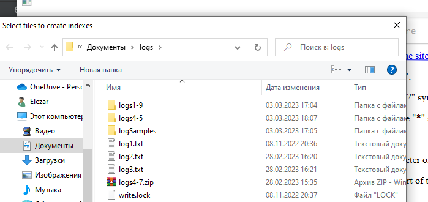

# indexer
Application with GUI for indexing big text files. 

## Description of the startup environment
**java version "1.8.0_261"**
**apache lucene version 8.11.1**
**spring-boot version 2.2.1.RELEASE**

## Description of Application
Application tested only on Windows 10.
It allows you to save considerable time in the framework of search queries on large files.
For example. Needs to find a query in 100gb file. If we do it straight through notepad, it will take about 20 minutes on one query.
If you use indexing before searching it will take the same time. But next search on this file takes only 1 minute or 
less! 
**In other words, it allows you to save a lot of time on repeated searches on big files.**

## How it works
1.1. Open project via IntelliJ IDEA or Eclipse and run com.elizarov.IndexerApplication.
You can see the main window of application.

1.2. Do **maven clean install** from source directory and run target/indexer-1.0-SNAPSHOT.jar by double click.
(if it does not work: Open regedit.exe search for : HKEY_CLASSES_ROOT\jarfile\shell\open\command 
and check your path to java.exe. <a href=https://superuser.com/questions/256570/java-jar-files-to-run-on-double-click>See here for more information</a>.)

2.Choose files you need to index via **Create Indexes** button.
(you may choose .log .txt .zip and ect. text files, exclude .rar and directories)

Javafx can't choose files and directories together like swing in one window. May be will change app for it later.
Directories in .zip archives will be indexed.
**100gb files will be indexed for about 20 minutes**
3. After receiving of the massage about index finishing.

**Enter your request on search field**

**Use lucene syntax for complex query**

4. Also, you may open files with text matches via text editor you prefer by right click on files in application 

5. 
**Add path to your editor on settings button.**

### Licence
Unlicensed